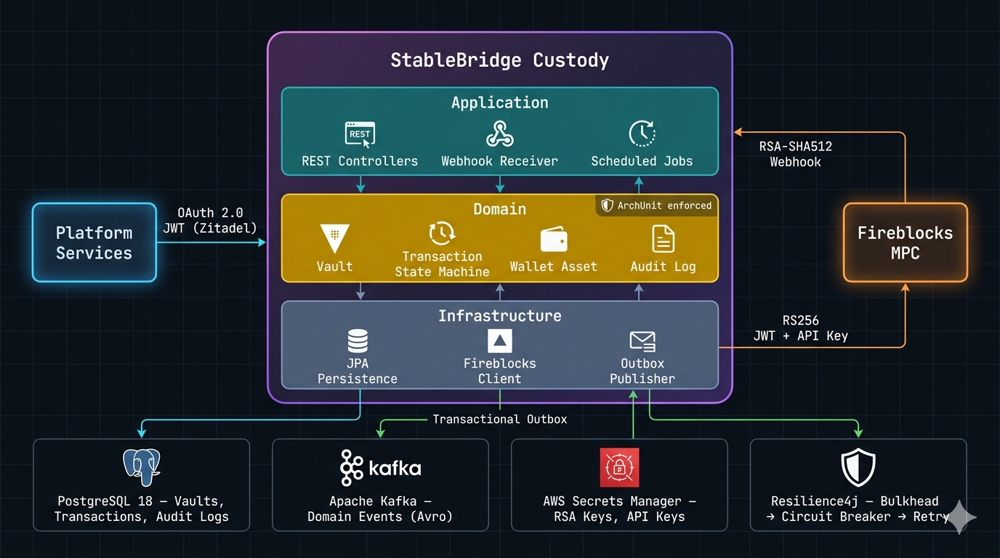

<div align="center">


# StableBridge Custody

### The bridge between your platform and institutional-grade crypto custody.

**A production-grade Fireblocks integration service for a MiCA-regulated euro stablecoin platform.**
Manages vault accounts, generates deposit addresses, submits MPC-signed transactions, tracks status via webhooks and polling, and publishes domain events through a transactional outbox — all behind OAuth 2.0 with full audit trail and 5-year regulatory retention.

[Why This Exists?](#-why-does-this-exist) · [Architecture](#-architecture) · [Life of a Transaction](#-life-of-a-transaction) · [Quick Start](#-quick-start) · [API Reference](#-api-reference) · [Tech Stack](#-tech-stack)



</div>

---

## The Problem

Crypto custody at institutional scale is deceptively hard. You need MPC-signed transactions, webhook-driven async flows, regulatory-grade audit trails, and an integration layer that doesn't fall over when your custody provider has a bad day. Here are the options:

| Option | What Happens | Verdict |
|---|---|---|
| **Use the Fireblocks SDK directly** | Scatter API calls across 12 services. No idempotency. No state machine. No resilience. | Works until it doesn't. Then you lose money. |
| **Build a thin wrapper** | Map 1:1 to Fireblocks endpoints. Hope webhooks arrive. Cross fingers on retries. | Fine for a hackathon. Terrifying for a regulated entity. |
| **Build a proper integration layer** | Domain-driven state machine. Transactional outbox. Circuit breakers. Webhook + polling dual-track. Full audit. | Production-grade. Regulator-approved. Sleep at night. |

StableBridge Custody is option 3 — a sharp, opinionated take on **Fireblocks integration** — written in Kotlin 2.3 with Spring Boot 4, hexagonal architecture, and zero tolerance for silent failures.

## The Solution

```text
 Platform Services           StableBridge Custody              Fireblocks
 ─────────────────           ────────────────────              ──────────

                    OAuth 2.0                     RS256 JWT
 create vault    ──────────►  domain state        ──────────►  MPC vault
 submit tx       ──────────►  machine             ──────────►  MPC signing
 get balance     ──────────►                      ──────────►  balance query
                              │
                              │ domain events
                              ▼
                    ┌──────────────────┐    Avro
                    │ transactional    │──────────►  Kafka topics
                    │ outbox (Namastack)│            (5 event types)
                    └──────────────────┘
                              ▲
                              │ webhook + polling
                    ┌─────────┴────────┐
                    │ dual-track status │◄─────────  Fireblocks webhooks
                    │ reconciliation    │◄─────────  ShedLock polling jobs
                    └──────────────────┘
```

## The Result

A custody integration that survives Fireblocks outages, satisfies MiCA auditors, and gives your platform a clean, idempotent REST API with event-driven notifications.

<div align="center">

| Metric | Value |
|--------|-------|
| **Auth model** | OAuth 2.0 (inbound) + per-request RS256 JWT (outbound to Fireblocks) |
| **State tracking** | Domain state machine: CREATED -> SUBMITTED -> PROCESSING -> CONFIRMING -> CONFIRMED |
| **Event delivery** | Transactional outbox — events are committed with the business transaction, never lost |
| **Resilience** | Bulkhead(25) -> CircuitBreaker(50%, 10-call window) -> Retry(3x exponential) |
| **Audit** | Immutable audit log with DB trigger preventing UPDATE/DELETE. 5-year MiCA retention. |
| **Idempotency** | Database-enforced: `customerRefId` for vaults, `externalTxId` for transactions |
| **Webhook security** | RSA-SHA512 signature verification + 5-minute replay window |
| **Coverage gates** | 80% line, 70% branch — enforced by Jacoco on every build |

</div>

---

## Table of Contents

- [Why Does This Exist?](#-why-does-this-exist)
- [Life of a Transaction](#-life-of-a-transaction)
- [Architecture](#-architecture)
- [The State Machine: Why Transactions Don't Get Lost](#-the-state-machine-why-transactions-dont-get-lost)
- [Dual-Track Status: Webhooks + Polling](#-dual-track-status-webhooks--polling)
- [The Transactional Outbox: Why Events Never Get Lost](#-the-transactional-outbox-why-events-never-get-lost)
- [Resilience: What Happens When Fireblocks Has a Bad Day](#-resilience-what-happens-when-fireblocks-has-a-bad-day)
- [Security: Two Borders, Two Authentication Models](#-security-two-borders-two-authentication-models)
- [MiCA Compliance: How This Service Satisfies EU Regulation](#-mica-compliance-how-this-service-satisfies-eu-regulation)
- [Tech Stack](#-tech-stack)
- [Module Structure](#-module-structure)
- [Quick Start](#-quick-start)
- [API Reference](#-api-reference)
- [Database Schema](#-database-schema)
- [Testing Strategy](#-testing-strategy)
- [Observability](#-observability)
- [Design Decisions](#-design-decisions)

---

## Why Does This Exist?

Because every crypto platform eventually asks the same questions:

- "Did our transaction actually confirm, or is it stuck in MPC signing?"
- "Can we prove to the Dutch Central Bank that every custody operation was authorized and audited?"
- "What happens to in-flight transactions when Fireblocks goes down for 30 minutes?"
- "How do we guarantee that a duplicate API call doesn't send the same payment twice?"
- "Can we reconstruct the complete history of every vault, asset, and transaction for the last 5 years?"

These questions need a **proper integration layer** — not scattered REST calls, not a thin SDK wrapper, not hope. You need a domain-driven service with a state machine, an audit trail, idempotency guarantees, and resilience patterns that handle real-world failure modes.

StableBridge Custody answers all five questions out of the box.

> **Design principle:** Correctness first. Every state transition is explicit. Every side effect is transactional. Every failure is visible. Silent failures are never an option.

---

## Life of a Transaction

> **Scene 1 — A platform service wants to send 1,000 EURC to an external address**

```text
 Platform Service          StableBridge Custody                      Fireblocks
 ────────────────          ────────────────────                      ──────────

 POST /api/v1/transactions
   externalTxId: "pay-7341"
   currency: "EURC"
   amount: "1000.00"
   destinationAddress: "0xabc..."
       │
       ▼
  OAuth 2.0 JWT validation
  (scope: custody:write)
       │
       ▼
  Vault lookup + assertActive()
       │
       ▼
  Asset resolution (EURC -> ETH_TEST6/EURC)
       │
       ▼
  Transaction.create(command)              POST /v1/transactions
  status: CREATED                            Authorization: Bearer <RS256 JWT>
       │                                     X-API-Key: <api-key>
       ▼                                     Body hash: SHA-256
  Fireblocks returns "fb-tx-001"                │
       │                                        ▼
  transaction.markSubmitted("fb-tx-001")   Fireblocks queues for
  status: SUBMITTED                        MPC signing
       │
       ▼
  INSERT transaction + outbox event
  (single @Transactional)
       │
       ▼
  Namastack outbox poller picks up event
       │
       ▼
  Kafka: custody.transaction.status-changed
  (key: "pay-7341", value: Avro)
```

> **Scene 2 — 30 seconds later, Fireblocks calls back**

```text
 Fireblocks                StableBridge Custody                Platform Consumers
 ──────────                ────────────────────                ──────────────────

 POST /api/v1/webhooks/fireblocks
   Fireblocks-Signature: <RSA-SHA512>
   {"type":"TRANSACTION_STATUS_UPDATED",
    "data":{"id":"fb-tx-001",
            "status":"COMPLETED",
            "txHash":"0xdef..."}}
       │
       ▼
  Signature verification
  (RSA-SHA512, public key from
   AWS Secrets Manager)
       │
       ▼
  Timestamp validation
  (reject if > 5 min old)
       │
       ▼
  Transaction lookup by
  fireblocksTransactionId
       │
       ▼
  State machine transition:
  SUBMITTED -> CONFIRMED
  (COMPLETED maps to CONFIRMED)
       │
       ▼
  UPDATE transaction
  + INSERT outbox event                   Kafka consumer receives:
  (single @Transactional)                 TransactionStatusChangedEvent
       │                                    externalTxId: "pay-7341"
       ▼                                    status: CONFIRMED
  Return 200 OK                             txHash: "0xdef..."
```

**Timeline for one transaction:**

| Stage | Latency | What happens |
|---|---|---|
| OAuth validation | ~5 ms | JWT signature + scope check via Zitadel JWKS |
| Domain logic | < 1 ms | Vault lookup, asset resolution, state creation |
| Fireblocks API call | 200-500 ms | Network hop + MPC queue submission |
| DB commit | ~5 ms | Transaction + outbox event in one `@Transactional` |
| Outbox -> Kafka | ~500 ms | Namastack polls at 500ms intervals |
| MPC signing | 10-60 s | Fireblocks multi-party computation |
| Webhook arrival | ~1 s after signing | Fireblocks pushes status update |
| **End-to-end** | **~30-90 s** | From API call to confirmed on-chain |

> **Scene 3 — A developer calls `GET /api/v1/transactions/pay-7341` and sees status CONFIRMED with the on-chain `txHash`. The platform credits the recipient's account. That's the whole movie.**

---

## Architecture

StableBridge Custody follows strict **hexagonal architecture (ports & adapters)** with DDD tactical patterns. Dependencies always point inward.

```text
                    ┌──────────────────────────────────────────────────┐
                    │                                                  │
                    │        application/ (inbound adapters)           │
                    │   ┌──────────────────────────────────────────┐   │
                    │   │ VaultController        REST endpoints    │   │
                    │   │ TransactionController   (OAuth 2.0)      │   │
                    │   │ BalanceController                        │   │
                    │   │ WebhookController       (RSA-SHA512)     │   │
                    │   │ TransactionPollingJob   (ShedLock)       │   │
                    │   │ VaultRecoveryJob        (ShedLock)       │   │
                    │   │ GlobalExceptionHandler                   │   │
                    │   │ SecurityConfiguration                    │   │
                    │   └──────────────────────────────────────────┘   │
                    │                     │                            │
                    │                     ▼ delegates to               │
                    │   ┌──────────────────────────────────────────┐   │
                    │   │          domain/ (pure business logic)   │   │
                    │   │                                          │   │
                    │   │   ┌─── model ───────┐                    │   │
                    │   │   │ Vault           │  data class        │   │
                    │   │   │ WalletAsset     │  + value class IDs │   │
                    │   │   │ DepositAddress  │  + state machines  │   │
                    │   │   │ Transaction     │  + copy() for      │   │
                    │   │   │ AuditLog        │    immutable       │   │
                    │   │   │ SupportedAsset  │    transitions     │   │
                    │   │   └─────────────────┘                    │   │
                    │   │                                          │   │
                    │   │   ┌─── service ─────┐                    │   │
                    │   │   │ VaultService    │  orchestration     │   │
                    │   │   │ TransactionSvc  │  + business rules  │   │
                    │   │   │ WebhookService  │  + state guards    │   │
                    │   │   │ BalanceService  │                    │   │
                    │   │   └─────────────────┘                    │   │
                    │   │                                          │   │
                    │   │   ┌─── port ────────┐                    │   │
                    │   │   │ VaultRepository │◄── implemented by  │   │
                    │   │   │ TxRepository    │    infrastructure  │   │
                    │   │   │ FireblocksPort  │                    │   │
                    │   │   │ EventPublisher  │                    │   │
                    │   │   └─────────────────┘                    │   │
                    │   │                                          │   │
                    │   │   ZERO framework imports.                │   │
                    │   │   Only @Service + @Transactional.        │   │
                    │   └──────────────────────────────────────────┘   │
                    │                     ▲                            │
                    │                     │ implements ports           │
                    │   ┌──────────────────────────────────────────┐   │
                    │   │    infrastructure/ (outbound adapters)   │   │
                    │   │                                          │   │
                    │   │   persistence/  JPA entities + repos     │   │
                    │   │   fireblocks/   @HttpExchange + JWT      │   │
                    │   │   messaging/    Namastack outbox         │   │
                    │   │   secrets/      AWS Secrets Manager      │   │
                    │   └──────────────────────────────────────────┘   │
                    │                                                  │
                    └──────────────────────────────────────────────────┘

                    ArchUnit enforces these rules at build time.
```

**The rules (enforced by ArchUnit):**

| Rule | What It Stops |
|---|---|
| `domain` cannot import `infrastructure` | Prevents domain from leaking JPA/HTTP types |
| `domain` cannot import `application` | Prevents domain from reaching up into controllers |
| `domain` has zero Spring Web / JPA imports | Keeps domain framework-free |
| Only `@Service` + `@Transactional` allowed in domain | Minimal DI wiring, nothing else |

Break any rule and the build fails. No social contracts, only compile errors.

---

## The State Machine: Why Transactions Don't Get Lost

Fireblocks has 15+ internal statuses. Our domain compresses them into 6 meaningful states with a strict, guarded state machine.

```text
                 ┌─────────────────────────────────────────────────────────┐
                 │              Transaction State Machine                  │
                 │                                                         │
                 │   CREATED ──► SUBMITTED ──► PROCESSING ──► CONFIRMING  │
                 │     │            │             │              │         │
                 │     │            │             │              ▼         │
                 │     │            │             │          CONFIRMED     │
                 │     │            │             │          (terminal)    │
                 │     ▼            ▼             ▼                        │
                 │   FAILED ◄──────────────────────────────────────────── │
                 │   (terminal)                                            │
                 └─────────────────────────────────────────────────────────┘
```

**Fireblocks status mapping:**

| Fireblocks Status | Internal State | Why |
|---|---|---|
| `SUBMITTED`, `PENDING_SIGNATURE`, `PENDING_AUTHORIZATION`, `QUEUED`, `BROADCASTING` | PROCESSING | All "in-flight" — MPC signing or broadcasting |
| `PENDING_AML_SCREENING`, `CANCELLING` | PROCESSING | Still in-flight from our perspective |
| `CONFIRMING` | CONFIRMING | On-chain, awaiting block confirmations |
| `COMPLETED` | CONFIRMED | Finalized on-chain (terminal) |
| `PARTIALLY_COMPLETED`, `FAILED`, `REJECTED`, `CANCELLED`, `BLOCKED`, `TIMEOUT` | FAILED | All failure modes (terminal) |

**Every transition is guarded.** The `guardTransition()` method rejects illegal jumps — you can't go from CONFIRMED back to PROCESSING, and you can't skip from CREATED to CONFIRMED. Invalid webhooks get logged and swallowed (return 200 to prevent re-delivery loops), but the domain state stays correct.

**Locking strategy:** Transactions use `SELECT FOR UPDATE` (pessimistic locking) because webhooks and polling jobs can race on the same transaction. Vaults use `@Version` (optimistic locking) because concurrent vault updates are rare and retryable.

---

## Dual-Track Status: Webhooks + Polling

Webhooks are fast but unreliable. Polling is reliable but slow. StableBridge uses both.

```text
                    ┌──────────────────────────────────────────┐
                    │         Dual-Track Reconciliation        │
                    │                                          │
                    │  Track 1: Webhooks (primary)             │
                    │  ─────────────────────────                │
                    │  Fireblocks pushes status updates         │
                    │  ~1-5 seconds after state change          │
                    │  RSA-SHA512 signature verified            │
                    │  Handles 95%+ of status updates           │
                    │                                          │
                    │  Track 2: Polling (fallback)              │
                    │  ────────────────────────                 │
                    │  ShedLock job every 2 minutes             │
                    │  Queries non-terminal transactions        │
                    │  stale > 5 minutes                        │
                    │  Catches missed/delayed webhooks          │
                    │  Handles the other 5%                     │
                    │                                          │
                    │  Both tracks converge on the same         │
                    │  state machine — idempotent by design.    │
                    └──────────────────────────────────────────┘
```

**Polling jobs (ShedLock-protected, PostgreSQL-backed):**

| Job | Interval | What It Does |
|---|---|---|
| Transaction Poller | 2 min | Polls Fireblocks for non-terminal txs stale > 5 min. Updates status + publishes event. |
| Stale CREATED Recovery | 2 min | Marks CREATED txs older than 5 min as FAILED (never reached Fireblocks). |
| Vault Recovery | 2 min | Checks PENDING vaults older than 5 min against Fireblocks. Activates or marks FAILED. |

**Why ShedLock?** In a multi-instance deployment, you don't want 3 replicas all polling Fireblocks simultaneously. ShedLock acquires a PostgreSQL row lock — only one instance runs each job at a time.

---

## The Transactional Outbox: Why Events Never Get Lost

The classic dual-write problem: you update the database and publish to Kafka. If the DB commit succeeds but Kafka publish fails, your consumers never learn about the state change. If you publish first and the DB fails, you've lied to your consumers.

```text
 The dual-write problem:

 ❌ Naive approach                    ✅ Transactional outbox
 ──────────────────                   ──────────────────────

 BEGIN                                BEGIN
   UPDATE transaction                   UPDATE transaction
   SET status = 'CONFIRMED'             SET status = 'CONFIRMED'
 COMMIT                                 INSERT INTO outbox_record (...)
                                      COMMIT
 kafkaTemplate.send(event)
      │                               Namastack poller (separate thread):
      ▼                                 SELECT FROM outbox_record
 💥 Kafka is down!                      WHERE processed = false
    Event lost forever.                 kafkaTemplate.send(event)
    Consumer never knows.               UPDATE outbox_record SET processed = true
                                        │
                                        ▼
                                      💥 Kafka is down?
                                        Poller retries next cycle.
                                        Event is still in the DB.
                                        Nothing is lost. Ever.
```

**Namastack transactional outbox** handles this. Domain services call `eventPublisher.publish()` inside `@Transactional(propagation = MANDATORY)`. The event is committed to the `custody_outbox_record` table atomically with the business data. A background poller picks up unpublished events and sends them to Kafka with Avro serialization.

**Events published:**

| Event | Topic | Partition Key | Trigger |
|---|---|---|---|
| `VaultCreatedEvent` | `custody.vault.created` | `vaultId` | Vault created in Fireblocks |
| `WalletAssetCreatedEvent` | `custody.wallet-asset.activated` | `vaultId` | Asset activated |
| `AddressCreatedEvent` | `custody.deposit-address.generated` | `vaultId` | Address generated |
| `TransactionCreatedEvent` | `custody.transaction.status-changed` | `externalTxId` | Transaction submitted |
| `TransactionStatusChangedEvent` | `custody.transaction.status-changed` | `externalTxId` | Status update |

**Ordering guarantee:** Per-entity ordering via partition keys. A vault's events always arrive in order. Cross-entity ordering is not guaranteed — consumers must be idempotent.

**Dead letter strategy:** Non-blocking retry with exponential backoff (`@RetryableTopic`): `main topic -> retry (1s) -> retry (5s) -> retry (25s) -> DLT`. Backoff config: `delay=1s, multiplier=5.0, maxDelay=30s`. Deserialization errors go straight to DLT.

---

## Resilience: What Happens When Fireblocks Has a Bad Day

Every Fireblocks API call passes through three layers of protection, applied via Resilience4j annotations in a strict order:

```text
 Platform API call
      │
      ▼
 ┌─────────────────────────────────────────────────┐
 │  Bulkhead (order=1)                             │
 │  ─────────────────                               │
 │  Max 25 concurrent Fireblocks calls.             │
 │  Prevents one slow endpoint from exhausting       │
 │  all threads.                                     │
 │                                                   │
 │  ┌───────────────────────────────────────────┐   │
 │  │  Circuit Breaker (order=2)                │   │
 │  │  ──────────────────────                    │   │
 │  │  50% failure threshold over 10-call        │   │
 │  │  sliding window.                           │   │
 │  │                                            │   │
 │  │  CLOSED ──► OPEN ──► HALF_OPEN ──► CLOSED │   │
 │  │                                            │   │
 │  │  Open state: 30s. Rejects calls fast.      │   │
 │  │  Half-open: 3 probe calls to test.         │   │
 │  │  Slow call threshold: 60% over 10s.        │   │
 │  │                                            │   │
 │  │  ┌─────────────────────────────────────┐   │   │
 │  │  │  Retry (order=3)                    │   │   │
 │  │  │  ─────────────                       │   │   │
 │  │  │  3 attempts: 500ms → 1s → 2s        │   │   │
 │  │  │  Retries on: IOException, 5xx       │   │   │
 │  │  │  No retry on: 4xx (client error)    │   │   │
 │  │  │                                     │   │   │
 │  │  │  ┌─────────────────────────────┐    │   │   │
 │  │  │  │  HTTP Call                  │    │   │   │
 │  │  │  │  Connect: 5s timeout        │    │   │   │
 │  │  │  │  Read: 30s timeout          │    │   │   │
 │  │  │  └─────────────────────────────┘    │   │   │
 │  │  └─────────────────────────────────────┘   │   │
 │  └───────────────────────────────────────────┘   │
 └─────────────────────────────────────────────────┘
```

**Separate circuit breakers:** Balance queries use an independent `fireblocks-balance` circuit breaker. If balance lookups start failing (Fireblocks rate-limits them aggressively), transaction submission stays unaffected.

**What happens during a 30-minute Fireblocks outage:**

| Minute | What happens |
|---|---|
| 0:00 | First few calls fail. Retry handles transient errors. |
| 0:01 | 50% failure rate crossed. Circuit breaker opens. |
| 0:01-0:30 | All calls rejected instantly (no network hop). API returns 502. |
| 0:30 | Fireblocks recovers. |
| 0:31 | Circuit breaker enters HALF_OPEN. 3 probe calls succeed. |
| 0:31 | Circuit breaker closes. Normal operation resumes. |
| 0:33 | Polling job picks up transactions that were CREATED during outage. Submits them. |
| 0:35 | Everything caught up. No transactions lost. |

---

## Security: Two Borders, Two Authentication Models

StableBridge sits between two trust boundaries, each with its own authentication scheme:

```text
 Platform Services              StableBridge                    Fireblocks
 ──────────────────             ────────────                    ──────────

         ┌── Border 1 ──┐              ┌── Border 2 ──┐
         │               │              │               │
  OAuth 2.0 JWT ────────►│  domain      │◄──── Per-request RS256 JWT
  (Zitadel OIDC)         │  logic       │       + API key + body hash
  scope: custody:read     │              │
  scope: custody:write    │              │       JWT payload:
         │               │              │         uri: /v1/transactions
  Webhook  ◄─────────────│              │         nonce: UUID
  (no OAuth)              │              │         exp: iat + 30s
  RSA-SHA512 sig ────────►│              │         bodyHash: SHA-256
  5-min replay window     │              │
         └───────────────┘              └───────────────┘
```

**Dual filter chain (Spring Security):**

| Chain | Order | Pattern | Auth Method |
|---|---|---|---|
| Webhook | `@Order(1)` | `/api/v1/webhooks/**` | `FireblocksWebhookAuthenticationFilter` — RSA-SHA512 signature + timestamp |
| API | `@Order(2)` | `/api/**` | OAuth 2.0 resource server — JWT from Zitadel |

**Scope mapping:**

| Scope | Grants |
|---|---|
| `custody:read` | GET endpoints — vault lookup, transaction status, balance query |
| `custody:write` | POST/PUT/PATCH/DELETE — vault creation, transaction submission, fee estimation |

**Secrets management:** All cryptographic material lives in AWS Secrets Manager (LocalStack for dev). Nothing in config files, nothing in environment variables.

| Secret | Type | Usage |
|---|---|---|
| Fireblocks RSA private key | PKCS#8 DER, Base64 | Signs per-request JWTs for Fireblocks API |
| Fireblocks API key | String | `X-API-Key` header on every Fireblocks call |
| Fireblocks webhook public key | X.509 | Verifies webhook signatures from Fireblocks |

---

## MiCA Compliance: How This Service Satisfies EU Regulation

[MiCA (Regulation (EU) 2023/1114)](https://eur-lex.europa.eu/eli/reg/2023/1114/oj/eng) is the EU's Markets in Crypto-Assets regulation. For crypto-asset service providers (CASPs) offering custody, it mandates strict requirements around client asset segregation, audit trails, operational resilience, and key management. This service is designed for a euro stablecoin platform regulated by the Dutch Central Bank (De Nederlandsche Bank).

Here's how each regulatory requirement maps to a concrete implementation in this codebase:

### Per-Client Asset Segregation — Art. 75(7)

MiCA requires that client crypto-assets are held on **separate DLT addresses** from the CASP's own assets, with legal and operational segregation.

```text
 Client A                    Client B                    CASP Operating
 ────────                    ────────                    ──────────────

 Vault: "client-a-ref"       Vault: "client-b-ref"       (separate, never
   └─ WalletAsset: ETH         └─ WalletAsset: ETH        commingled)
       └─ Address: 0xabc...        └─ Address: 0xdef...
   └─ WalletAsset: EURC        └─ WalletAsset: SOL
       └─ Address: 0xabc...        └─ Address: 5Kx7...
       (ERC-20 shares ETH addr)
```

**Implementation:** Each client maps to a unique Fireblocks vault via `customerRefId` (UNIQUE database constraint). One vault = one MPC key set = separate on-chain addresses. No omnibus wallets, no commingling.

### Immutable Audit Trail — Art. 68(9), Art. 75(3)

MiCA requires records of **all crypto-asset services, orders, and transactions** in a format that allows regulators to reconstruct each step. Records must be retained for a **minimum of 5 years**.

```text
 audit_logs (INSERT-ONLY)
 ────────────────────────
 id          operation                    resource_id     actor    status    details (JSONB)
 ─────────── ──────────────────────────── ─────────────── ──────── ──────── ──────────────────
 a1b2c3...   VAULT_CREATED                vault-001       system   SUCCESS  {fireblocksVaultId: "fb-1"}
 d4e5f6...   ASSET_ACTIVATED              asset-001       system   SUCCESS  {currency: "ETH"}
 g7h8i9...   ADDRESS_GENERATED            addr-001        system   SUCCESS  {address: "0xabc..."}
 j0k1l2...   TRANSACTION_SUBMITTED        tx-001          system   SUCCESS  {fireblocksTransactionId: "fb-tx-1"}
 m3n4o5...   TRANSACTION_STATUS_UPDATED   tx-001          system   SUCCESS  {from: "SUBMITTED", to: "CONFIRMED"}
 p6q7r8...   WEBHOOK_RECEIVED             tx-001          system   SUCCESS  {fireblocksStatus: "COMPLETED"}

 PostgreSQL trigger: BEFORE UPDATE OR DELETE → RAISE EXCEPTION
 'audit_logs table is immutable: UPDATE not allowed'
```

**Implementation:** 11 audit operation types cover every custody action. A PostgreSQL trigger on `audit_logs` physically prevents UPDATE and DELETE — not even a DBA can tamper with the trail. No DELETE operations exist anywhere in the codebase. All entities are insert-only or insert+update.

| Audit Operation | What It Records |
|---|---|
| `VAULT_CREATED` | New vault account provisioned in Fireblocks |
| `VAULT_CREATION_FAILED` | Fireblocks vault creation failed |
| `ASSET_ACTIVATED` | Crypto asset activated in a vault |
| `ADDRESS_GENERATED` | Deposit address generated on-chain |
| `TRANSACTION_SUBMITTED` | Transaction sent to Fireblocks for MPC signing |
| `TRANSACTION_SUBMISSION_FAILED` | Fireblocks rejected the transaction |
| `TRANSACTION_STATUS_UPDATED` | Status change (via webhook or polling) |
| `WEBHOOK_RECEIVED` | Inbound Fireblocks webhook processed |
| `WEBHOOK_VERIFICATION_FAILED` | Invalid/spoofed webhook rejected |
| `BALANCE_QUERIED` | Balance lookup from Fireblocks |
| `FEE_ESTIMATED` | Fee estimation requested |

### Full Transaction Traceability — Art. 75(3)

MiCA requires a register recording **every movement and operation without undue delay**, including types, balances, values, and transfer history.

**Implementation:** Every transaction state change produces two durable records atomically (same `@Transactional`):

1. **Audit log entry** — immutable, who/what/when/result
2. **Domain event via transactional outbox** — published to Kafka for downstream consumers

The state machine (CREATED -> SUBMITTED -> PROCESSING -> CONFIRMING -> CONFIRMED / FAILED) ensures no transition is silent. Every status maps from Fireblocks' 15+ internal statuses to 6 domain states, and every mapping is logged.

### Idempotency Guarantees — Art. 75(3), Art. 75(5)

MiCA prohibits using client assets for the CASP's own purposes and requires accurate position registers. Duplicate operations would corrupt both.

**Implementation:** Database-enforced uniqueness:
- `vaults.customer_ref_id` — UNIQUE constraint. Duplicate vault creation returns existing vault (409).
- `transactions.external_tx_id` — UNIQUE constraint. Duplicate transaction submission returns existing transaction (409).

No custody operation can accidentally execute twice.

### Operational Resilience — DORA Art. 5-12

MiCA cross-references [DORA (Regulation (EU) 2022/2554)](https://www.digital-operational-resilience-act.com/DORA_Articles.html), requiring CASPs to maintain resilient ICT systems with tested recovery procedures.

**Implementation:**

| DORA Requirement | How It's Met |
|---|---|
| **ICT risk management** (Art. 5-7) | Resilience4j stack: Bulkhead (25 concurrent) -> Circuit Breaker (50% threshold) -> Retry (3x exponential) |
| **Detection of anomalous activities** (Art. 9-10) | Health probes (`/actuator/health/liveness`, `/actuator/health/readiness`, custom Fireblocks probe), Prometheus metrics, circuit breaker state monitoring |
| **Response and recovery** (Art. 11) | Dual-track reconciliation: webhooks (primary, ~1-5s) + ShedLock polling (fallback, every 2 min). Stale CREATED transactions auto-recovered. Pending vaults auto-recovered. |
| **Continuity during provider outage** (Art. 6) | Circuit breaker opens after failures -> rejects fast (no cascade) -> half-open probes -> auto-recovers when Fireblocks returns. Polling job catches up missed state changes. |
| **Third-party ICT risk** (Art. 25-26) | Separate `fireblocks-balance` circuit breaker isolates balance query failures from transaction operations. Fireblocks API monitored via Micrometer metrics. |

### Cryptographic Key Management — ESMA Guidelines

ESMA's guidelines on maintenance of systems and security access protocols require audited key management with access controls.

**Implementation:** This service **never touches raw private keys**. MPC signing is delegated entirely to Fireblocks:

| Secret | Storage | Access Pattern |
|---|---|---|
| Fireblocks RSA private key (API auth) | AWS Secrets Manager | Loaded once at startup -> `RSAPrivateKey` bean. Signs per-request JWTs (30s expiry, SHA-256 body hash, UUID nonce). |
| Fireblocks API key | AWS Secrets Manager | Loaded once at startup -> `String` bean. Sent as `X-API-Key` header. |
| Fireblocks webhook public key | AWS Secrets Manager | Loaded once at startup -> `RSAPublicKey` bean. Verifies RSA-SHA512 webhook signatures. |

No key material in config files, environment variables, or log output (verified by business test: `should not expose internal details in error responses`).

### Webhook Security & Replay Protection — Art. 75(2)

MiCA requires description of ICT security systems in the custody policy. Webhook integrity is critical — a spoofed webhook could corrupt the transaction register.

**Implementation:**
- **RSA-SHA512 signature verification** — every webhook's `Fireblocks-Signature` header is verified against the Fireblocks public key
- **5-minute replay window** — webhooks with `createdAt` older than 5 minutes are rejected, preventing replay attacks
- **Idempotent processing** — re-delivered webhooks for already-terminal transactions return 200 without state corruption

---

## Tech Stack

| Component | Choice | Version | Why |
|-----------|--------|---------|-----|
| **Language** | Kotlin | 2.3.0 | Null safety, data classes, extension functions, coroutine-ready |
| **Runtime** | JDK | 25 LTS | Latest LTS, value classes preview, structured concurrency |
| **Framework** | Spring Boot | 4.0.6 | Spring Framework 7, `@HttpExchange` declarative clients |
| **Database** | PostgreSQL | 18 | ACID, JSONB audit logs, `SELECT FOR UPDATE` |
| **Messaging** | Apache Kafka + Schema Registry | Confluent 8.2 | Avro serialization, at-least-once delivery via transactional outbox |
| **Outbox** | Namastack Outbox Starter | 1.6.0 | Transactional outbox, polling-based, JDBC-backed |
| **Auth (inbound)** | Zitadel | 4.15 | OAuth 2.0 / OIDC, scope-based authorization |
| **Auth (outbound)** | JJWT | 0.13 | Per-request RS256 JWT signing for Fireblocks API |
| **Secrets** | AWS Secrets Manager | SDK 2.44 | LocalStack for dev, real AWS in prod |
| **Resilience** | Resilience4j | 2.4.0 | Bulkhead + CircuitBreaker + Retry, annotation-driven |
| **Job locking** | ShedLock | 7.7.0 | PostgreSQL-backed distributed lock for scheduled jobs |
| **Migrations** | Flyway | latest | Sequential versioned migrations |
| **HTTP client** | Spring `@HttpExchange` + `RestClient` | Spring 7 | Declarative interface, `SimpleClientHttpRequestFactory` |
| **Observability** | Micrometer + OpenTelemetry | latest | Structured logging, distributed tracing, Prometheus metrics |
| **Testing** | JUnit 5 + MockK + AssertJ + Testcontainers + WireMock + ArchUnit | latest | 4-tier test pyramid |
| **Code quality** | Ktlint + Jacoco | latest | Auto-formatting + 80/70 coverage gates |

### What StableBridge Explicitly Does Not Use

| Avoided | Replacement | Why |
|---|---|---|
| **Fireblocks Java SDK** | Thin `@HttpExchange` client | SDK drags in transitive deps, poorly typed. 2 interfaces + JWT interceptor is all we need. |
| **Mockito** | MockK | Kotlin-native. `every { }` / `verify { }` instead of fighting `when()` with backticks. |
| **MapStruct** | Kotlin extension functions | `toEntity()`, `toDomain()`, `toResponse()` — 3-line functions, no annotation processor. |
| **Lombok** | Kotlin data classes | `data class` gives `equals`, `hashCode`, `copy`, `toString` for free. |
| **`Optional<T>`** | Nullable types `T?` | Kotlin null safety > Java Optional ceremony. |
| **`@Autowired`** | Primary constructor injection | Kotlin primary constructors are the constructor. |
| **Direct Kafka publishing** | Transactional outbox | Never lose an event. Ever. |
| **Comments / Javadoc** | Self-documenting code | If a method needs a comment, rename it. |

---

## Module Structure

```text
fire-block-integration/                      root project
│
├── custody-fireblocks/                      Spring Boot application
│   └── src/
│       ├── main/kotlin/.../
│       │   ├── application/                 inbound adapters
│       │   │   ├── controller/              REST controllers (thin, delegates to domain)
│       │   │   ├── webhook/                 Fireblocks webhook receiver
│       │   │   ├── config/                  Spring configuration beans
│       │   │   ├── security/                OAuth 2.0 + webhook signature filter
│       │   │   ├── job/                     Scheduled polling + recovery jobs
│       │   │   ├── exception/               GlobalExceptionHandler (error codes)
│       │   │   └── mapper/                  Request/response mapping extensions
│       │   │
│       │   ├── domain/                      core business logic (zero framework imports)
│       │   │   ├── vault/                   Vault aggregate: model, service, port, repository
│       │   │   ├── wallet/                  WalletAsset + DepositAddress aggregates
│       │   │   ├── transaction/             Transaction aggregate + state machine
│       │   │   ├── audit/                   AuditLog (immutable, insert-only)
│       │   │   ├── event/                   Domain event types
│       │   │   ├── port/                    Outbound port interfaces
│       │   │   └── shared/                  StateMachine, CustodyException, ErrorCode
│       │   │
│       │   └── infrastructure/              outbound adapters
│       │       ├── persistence/             JPA entities + Spring Data repositories
│       │       ├── fireblocks/              @HttpExchange client + JWT interceptor
│       │       ├── messaging/               Namastack outbox publishers + Kafka consumers
│       │       ├── secrets/                 AWS Secrets Manager configuration
│       │       └── scheduling/              ShedLock + recovery job implementations
│       │
│       ├── test/                            Unit tests (MockK, ArchUnit)
│       ├── testFixtures/                    Shared fixtures: aVault(), aTransaction(), stubs
│       ├── integrationTest/                 Testcontainers integration tests
│       └── businessTest/                    Full E2E business flow tests
│
├── custody-fireblocks-api/                  java-library — shared API contracts
│   └── src/main/kotlin/.../api/
│       ├── request/                         CreateVaultRequest, SubmitTransactionRequest, ...
│       ├── response/                        VaultResponse, TransactionResponse, ...
│       ├── event/                           Domain event DTOs for Kafka
│       └── error/                           ApiError, ErrorCode enums
│
├── custody-fireblocks-client/               java-library — REST client SDK
│   └── src/main/kotlin/.../client/          @HttpExchange interface + auto-config
│
├── docker-compose.yml                       PostgreSQL, Kafka, Schema Registry,
│                                            LocalStack, Zitadel, CockroachDB
├── .github/workflows/ci.yml                 GitHub Actions CI pipeline
└── docs/
    ├── SPEC.md                              Full service specification
    ├── ADR.md                               Architecture decision records
    ├── KOTLIN_CODING_STANDARDS.md           Comprehensive Kotlin style guide
    ├── TESTING_STANDARDS.md                 Test patterns and conventions
    └── PROJECT_STRUCTURE.md                 File placement decision tree
```

---

## Quick Start

### Prerequisites

- **Docker & Docker Compose** (for PostgreSQL, Kafka, Schema Registry, LocalStack, Zitadel)
- **JDK 25** (for local builds)
- **Gradle 9.5** (wrapper included)

### 60-Second Onboarding

```bash
# 1. Clone
git clone https://github.com/Puneethkumarck/fire-block-integration.git
cd fire-block-integration

# 2. Boot the infrastructure
docker compose up -d

# 3. Run the service
./gradlew bootRun

# 4. In another terminal — test it works
# Get an OAuth token from Zitadel (localhost:8085)
# Then:
curl -s http://localhost:8082/actuator/health | jq
```

### Build Commands

```bash
./gradlew build                          # Full: compile + all tests + ktlint + jacoco
./gradlew compileKotlin                  # Compile only
./gradlew test                           # Unit tests + ArchUnit
./gradlew integrationTest                # Integration tests (needs Docker)
./gradlew businessTest                   # E2E business tests (needs Docker)
./gradlew ktlintFormat                   # Auto-fix formatting
./gradlew jacocoTestCoverageVerification # Enforce 80% line / 70% branch gates
```

### Run a Single Test

```bash
./gradlew test --tests "com.stablecoin.custody.fireblocks.domain.vault.VaultServiceTest"
./gradlew businessTest --tests "*TransactionLifecycleBusinessTest"
```

---

## API Reference

Base URL: `http://localhost:8080/api/v1` — all endpoints require OAuth 2.0 JWT unless noted.
Actuator: `http://localhost:8082/actuator` — served on a separate management port.

### Vault Operations

| Method | Endpoint | Scope | Description |
|---|---|---|---|
| `POST` | `/vaults` | `custody:write` | Create a vault account |
| `GET` | `/vaults/{id}` | `custody:read` | Get vault by ID |

### Asset & Address Operations

| Method | Endpoint | Scope | Description |
|---|---|---|---|
| `POST` | `/vaults/{vaultId}/assets` | `custody:write` | Activate asset in vault |
| `POST` | `/vaults/{vaultId}/assets/{currency}/{protocol}/addresses` | `custody:write` | Generate deposit address |
| `GET` | `/vaults/{vaultId}/assets/{currency}/{protocol}/balance?refresh=true` | `custody:read` | Get balance (optional Fireblocks refresh) |

### Transaction Operations

| Method | Endpoint | Scope | Description |
|---|---|---|---|
| `POST` | `/transactions` | `custody:write` | Submit transaction for MPC signing |
| `GET` | `/transactions/{externalTxId}` | `custody:read` | Get transaction by platform ID |
| `GET` | `/transactions/fireblocks/{fireblocksTxId}` | `custody:read` | Get transaction by Fireblocks ID |
| `POST` | `/transactions/estimate-fee` | `custody:write` | Estimate transaction fee (all levels) |

### Webhook (No OAuth)

| Method | Endpoint | Auth | Description |
|---|---|---|---|
| `POST` | `/api/v1/webhooks/fireblocks` | RSA-SHA512 signature | Receive Fireblocks status updates |

### Error Response Format

Every error follows a consistent structure:

```json
{
  "code": "CUSTODY-1001",
  "status": "Not Found",
  "message": "Vault not found",
  "traceId": "6a3e4b2c-..."
}
```

| Code | Status | Meaning |
|---|---|---|
| `CUSTODY-0001` | 400 | Validation failed (blank fields, invalid amounts) |
| `CUSTODY-1001` | 404 | Vault not found |
| `CUSTODY-1002` | 409 | Vault already exists (returns existing — idempotent) |
| `CUSTODY-1003` | 404 | Asset not found / unsupported currency-protocol pair |
| `CUSTODY-1004` | 404 | Transaction not found |
| `CUSTODY-1005` | 409 | Transaction already exists (returns existing — idempotent) |
| `CUSTODY-1006` | 422 | Vault not in ACTIVE state |
| `CUSTODY-2001` | 422 | Invalid transaction state transition |
| `CUSTODY-3001` | 502 | Fireblocks API error / unavailable |
| `CUSTODY-3002` | 504 | Fireblocks API timeout |
| `CUSTODY-4001` | 401 | Webhook signature verification failed |
| `CUSTODY-5001` | 500 | Unexpected internal error |
| `CUSTODY-5002` | 409 | Optimistic locking conflict (retry) |

---

## Database Schema

10 Flyway migrations, 7 tables, strict locking disciplines, and an immutable audit log.

```text
 vaults                          wallet_assets                deposit_addresses
 ──────                          ─────────────                ─────────────────
 id            UUID PK           id            UUID PK        id              UUID PK
 customer_ref_id  UNIQUE         vault_id      FK → vaults    wallet_asset_id FK → wallet_assets
 fireblocks_vault_id             currency      VARCHAR        address         VARCHAR
 name          VARCHAR           protocol      VARCHAR        tag             VARCHAR?
 status        VARCHAR           fireblocks_asset_id          legacy_address  VARCHAR?
 version       BIGINT (@Version) status        VARCHAR        version         BIGINT
 created_at    TIMESTAMPTZ       version       BIGINT
 updated_at    TIMESTAMPTZ       (vault_id, currency, protocol) UNIQUE

 transactions                    audit_logs (IMMUTABLE)       supported_assets
 ────────────                    ──────────────────────       ────────────────
 id            UUID PK           id          UUID PK          id        UUID PK
 external_tx_id  UNIQUE          timestamp   TIMESTAMPTZ      currency  VARCHAR
 fireblocks_tx_id                actor       VARCHAR          protocol  VARCHAR
 status        VARCHAR           operation   VARCHAR          fireblocks_asset_id
 amount        NUMERIC(36,18)    resource_id VARCHAR          name      VARCHAR
 currency      VARCHAR           status      VARCHAR
 destination_address             details     JSONB            custody_outbox_record
 tx_hash       VARCHAR?                                       ────────────────────
 version       BIGINT            DB TRIGGER: blocks           (Namastack outbox table)
 (SELECT FOR UPDATE)             UPDATE and DELETE
                                                              shedlock
                                                              ────────
                                                              (ShedLock distributed lock)
```

**Locking strategy:**

| Entity | Lock Type | Why |
|---|---|---|
| Vault | Optimistic (`@Version`) | Concurrent vault updates are rare, retryable |
| WalletAsset | Optimistic (`@Version`) | Low contention |
| Transaction | Pessimistic (`SELECT FOR UPDATE`) | Webhooks + polling can race on same transaction |
| AuditLog | None | Insert-only, immutable, DB trigger prevents mutation |

**Delete policy:** No deletes anywhere. All entities are insert-only or insert+update. MiCA requires 5-year retention of all custody operations.

---

## Testing Strategy

Four-tier pyramid with strict conventions, enforced by ArchUnit and Jacoco gates.

```text
                        ┌──────────────────────┐
                        │    Business Tests     │  Full E2E flows against real
                        │    (Docker, WireMock) │  Spring context + Testcontainers
                        ├──────────────────────┤  + WireMock (Fireblocks stub)
                        │   Integration Tests   │  + custody-fireblocks-client
                        │   (Docker, WireMock)  │
                    ┌───┴──────────────────────┴───┐
                    │      Unit + Architecture      │  MockK, AssertJ, ArchUnit
                    │      (no Docker, fast)        │  Single recursive assertion
                    └──────────────────────────────┘
```

| Tier | Source Set | Scope | Needs Docker? |
|---|---|---|---|
| **Unit** | `src/test/` | Single class, mocked deps | No |
| **Architecture** | `src/test/` | Hexagonal layer rules via ArchUnit | No |
| **Integration** | `src/integrationTest/` | Spring context, real DB, WireMock for Fireblocks | Yes |
| **Business** | `src/businessTest/` | Full E2E flows: vault lifecycle, transaction lifecycle, edge cases | Yes |

**Testcontainers singleton pattern:** `AbstractIntegrationTest` starts containers once and reuses across all test classes:
- PostgreSQL 17 (real database with Flyway migrations)
- Kafka + Schema Registry (real event publishing)
- LocalStack (AWS Secrets Manager with test keys)
- WireMock (Fireblocks API stub with programmable responses)

**Non-negotiable testing rules:**

| Rule | What It Means |
|---|---|
| **Single recursive comparison** | Build an expected object, then `assertThat(actual).usingRecursiveComparison().ignoringFields(...).isEqualTo(expected)`. Never multiple `assertThat` calls on individual fields. |
| **MockK only** | `every { }` / `verify { }`. Mockito is excluded from the classpath. |
| **Given/When/Then markers** | `// given`, `// when`, `// then` comments structure every test. |
| **Backtick test names** | `` fun `should create vault when valid command`() `` — reads like a specification. |
| **Fixtures in testFixtures/** | `aVault()`, `aTransaction()` — top-level functions with sensible defaults. Not private methods in test classes. |

**Coverage gates (Jacoco, enforced on every build):**

| Counter | Minimum |
|---|---|
| Line | 80% |
| Branch | 70% |

---

## Observability

| Layer | Technology | Details |
|---|---|---|
| **Structured logging** | Logback + `logstash-logback-encoder` | JSON format, every line includes `traceId`, `spanId` |
| **Distributed tracing** | Micrometer + OpenTelemetry bridge | Auto-instrumented, propagated across Kafka messages |
| **Metrics** | Micrometer + Prometheus | Circuit breaker state, Fireblocks API latency, DLT consumer lag |
| **Health checks** | Spring Actuator (port 8082) | `/actuator/health/liveness`, `/actuator/health/readiness`, custom Fireblocks probe |

**Latency targets:**

| Endpoint Type | p99 Target |
|---|---|
| Read (GET) | < 500 ms |
| Write (POST) | < 2 s |
| Webhook processing | < 1 s |

---

## Design Decisions

| # | Decision | Problem | Impact |
|---|---|---|---|
| 1 | **Hexagonal architecture + ArchUnit** | Framework coupling creeps into domain logic | Domain has zero Spring/JPA imports — verified every build |
| 2 | **Transactional outbox (Namastack)** | Dual-write problem: DB commit + Kafka publish can diverge | Events are committed atomically with business data. Zero lost events. |
| 3 | **Pessimistic locking for transactions** | Webhooks and polling jobs race on the same row | `SELECT FOR UPDATE` prevents double-processing |
| 4 | **Separate circuit breakers** | Balance failures poisoning transaction circuit breaker | `fireblocks-balance` CB is independent from main `fireblocks` CB |
| 5 | **Per-request JWT (not session)** | Fireblocks requires fresh JWT with body hash per call | 30s expiry, SHA-256 body hash, nonce — replay-resistant by design |
| 6 | **Webhook + polling dual-track** | Webhooks are fast but unreliable; polling is reliable but slow | 95%+ via webhooks, remainder caught by 2-min polling fallback |
| 7 | **Immutable audit log + DB trigger** | Regulatory requirement: prove operations were never tampered with | PostgreSQL trigger prevents UPDATE/DELETE. Application code can only INSERT. |
| 8 | **`@JvmInline value class` for IDs** | `UUID` params are interchangeable — `vaultId` accepted where `transactionId` expected | `VaultId`, `TransactionId` are distinct types. Compiler catches mix-ups. |
| 9 | **ShedLock for scheduled jobs** | Multi-instance deployment: N replicas = N duplicate polling runs | PostgreSQL row lock. One instance per job at a time. |
| 10 | **No Fireblocks SDK** | SDK drags in transitive dependencies, poorly typed, opinionated | 2 `@HttpExchange` interfaces + JWT interceptor. Full control, minimal surface. |
| 11 | **Kotlin extension functions for mapping** | MapStruct annotation processor adds build complexity | `toEntity()`, `toDomain()` — 3-line functions, no codegen |
| 12 | **`customerRefId` / `externalTxId` uniqueness** | Duplicate API calls must be safe | DB constraint catches duplicates. Returns existing resource with 409. |

---

<div align="center">

### StableBridge Custody — The bridge between your platform and institutional-grade crypto custody.

Built on **Kotlin 2.3 · Spring Boot 4 · JDK 25 · PostgreSQL · Kafka · Fireblocks MPC**
Hexagonal architecture · Transactional outbox · Circuit breakers · Full audit trail

*Every vault. Every transaction. Every state transition. Auditable forever.*

</div>
